<a id="T_0BF18B88"></a>

# Battery State\-of\-Charge (SOC) Estimation using a Feed\-Forward Network

In this example, you will create an AI model for performing battery State\-of\-Charge (SOC) estimation by loading data, defining the architecture of a feed\-forward neural network, training the network, and exporting the trained network to Simulink for running simulations.

<!-- Begin Toc -->

## Table of Contents
&#8195;[Open the instructions in a browser (Optional)](#TMP_0786)
 
&#8195;[Data Preparation](#H_18106281)
 
&#8195;&#8195;[Load Train & Test Data](#TMP_2822)
 
&#8195;[Build an AI Model](#H_767342F2)
 
&#8195;&#8195;[Define Neural Network Architecture](#TMP_94da)
 
&#8195;&#8195;[Export the network architecture to the MATLAB workspace](#TMP_9a06)
 
&#8195;&#8195;[Set Training Options and train the network](#TMP_628b)
 
&#8195;&#8195;[Evaluate the network on a held\-out test data set](#TMP_2d72)
 
&#8195;&#8195;[Save the AI Model as a File](#TMP_4289)
 
&#8195;[**Integrate the Trained Network into Simulink**](#H_715EA024)
 
&#8195;&#8195;[**Generate the Inputs for Simulink**](#TMP_846c)
 
&#8195;&#8195;[Launch Simulink:](#TMP_28ad)
 
&#8195;&#8195;[Configure Network to Use for Predict Block](#TMP_9de9)
 
&#8195;&#8195;[Configure Model Parameters for Simulations](#TMP_020e)
 
&#8195;&#8195;[**Connect the Model**](#TMP_41c9)
 
&#8195;&#8195;[Run the Simulink Model](#TMP_25c3)
 
&#8195;[References](#H_7BF2DEA5)
 
<!-- End Toc -->
<a id="TMP_0786"></a>

# Open the instructions in a browser (Optional) 

We have provided an option for you to have a separate window with the instructions for this exercise for a smoother experience.

```matlab
open("Exercise_1.html");
```

<a id="H_18106281"></a>

# Data Preparation

The training data contains a single sequence of experimental data collected while the battery powered an electric vehicle during a driving four driving cycles at different temperatures (\-10ºC, 0ºC, 10ºC and 25ºC). The test data contains four sequences of experimental data collected during driving cycles at the same temperatures. This example uses the preprocessed data set `LG_HG2_Prepared_Dataset_McMasterUniversity_Jan_2020` from \[1\]. You can download this data set manually from [https://data.mendeley.com/datasets/cp3473x7xv/3](https://data.mendeley.com/datasets/cp3473x7xv/3). 

We have data stored in three different folders: Test, Train and Validation.

All data is already stored in ".mat" files, the input variables in a matrix X and the response variables in Y.

```matlab
clear
if isempty(matlab.project.rootProject)
    error("No project loaded. Please load Aimbdworkshop.prj to proceed.")
else
    dataFolder = helper.getDataFolder();
end 
```

<a id="TMP_2822"></a>

## Load Train & Test Data

"numFeatures" denotes the number of inputs features used. We can choose from five features (voltage, current, temperature, V\_avg, I\_avg), where the last two (V\_avg, I\_avg) are the averaged values for voltage and current.

```matlab
trainingFile = fullfile(dataFolder,"Train", ...
    "TRAIN_LGHG2@n10degC_to_25degC_Norm_5Inputs.mat");
[X,Y] = helper.loadData(trainingFile);


validationFile = fullfile(dataFolder,"Validation", ...
    "01_TEST_LGHG2@n10degC_Norm_(05_Inputs).mat");
[valX,valY] = helper.loadData(validationFile);
```

<a id="H_767342F2"></a>

# Build an AI Model
<a id="TMP_94da"></a>

## Define Neural Network Architecture

There are many possible choices for defining the network architecture. We have three base predictors, voltage, current and temperature. We can also use moving averages of voltage (V\_avg) and currrent (I\_avg) in order to provide the network with information about past values. This is useful for improving the accuracy of feedforward networks, but not equally necessary with other networks like the recurrent networks such as LSTM (long short\-term memory), or GRU (gated recurrent unit).

Let's use the following MLP (multi\-layer perceptron) model. It is probably one of the simplest architectures you could choose.  You can define the network programmatically or use a graphical interface provided by the **Deep Network Designer** app. For this exercise, we will define a partial network programmatically and then complete the architecture using the **Deep Network Designer** app. 

```matlab
% Define the first two layers programmatically 
layers = [
    featureInputLayer(5,"Name","featureinput")
    fullyConnectedLayer(128,"Name","fc")];
```

In the Deep Network Designer App we define the network architecture via dragging and dropping the layers from the layer library to the left. You can also search for layers in the library by name. Here is how we build the rest of the network:

**TODO: Add the two highlighted layers to the network with their respective property values shown in the diagram below.**

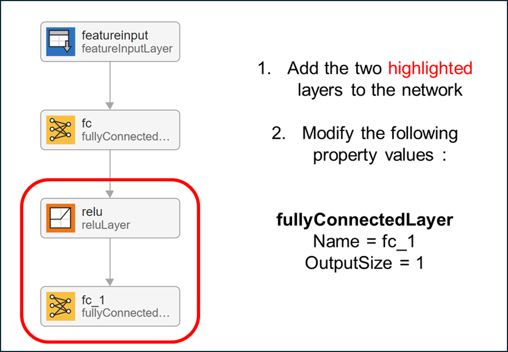

When you are done, you can click the Analyze button to  understand the architecture of a network, check that you have defined the architecture correctly, and detect problems before training.

```matlab
deepNetworkDesigner(layers)
```

<a id="TMP_9a06"></a>

## Export the network architecture to the MATLAB workspace

Now, we can go ahead an export the network to the MATLAB workspace. We click the green Export checkmark and select "Export to workspace".

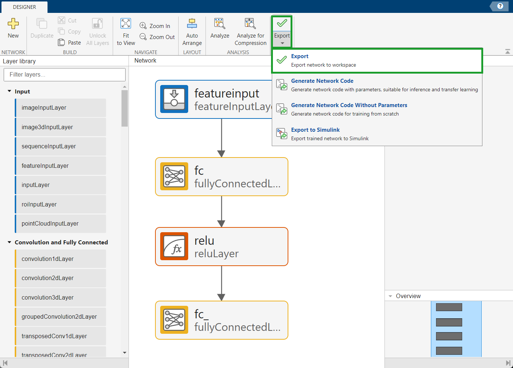

Specify the name of the network as net\_1.

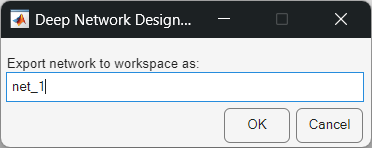

<a id="M_85156D5D"></a>
A dialog appears stating that the export to the variable net\_`1` was successful.

If our network was already trained, we could directly export from here to Simulink as well.

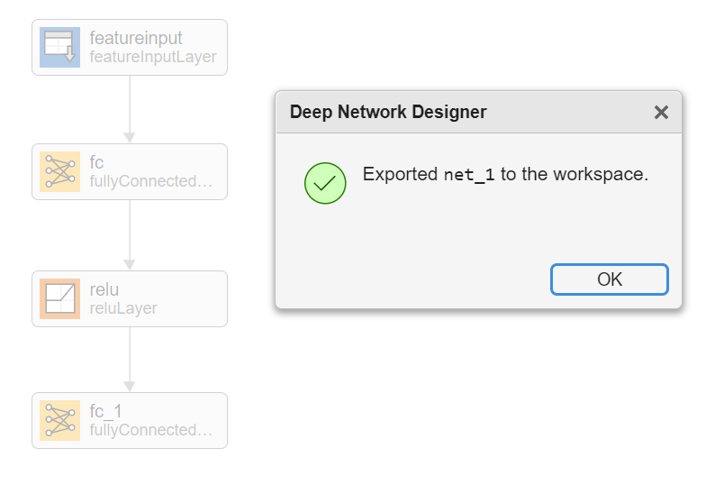

<a id="TMP_628b"></a>

## Set Training Options and train the network

There are many settings that control the training algorithm. Among the most important are

- **Solver**: Which solver to use, e.g. SGDM or ADAM
- **InitialLearnRate**: determines the step size of the algorithm.
- **MaxEpochs**: controls how many passes through the entire data set are made

**TODO:**

Try out different values for the control elements and retrain via executing this section only. Some values we tried that work relatively well:

1) Set the **Solver** to "adam"

2) Set the **InitialLearnRate** to 0.001

3) Set the **MiniBatchSize** to 1000

4) Set **MaxExpochs** to 3

Also, we want to plot our training progress including the validation data:

```matlab
shouldTrainModel = true;


if shouldTrainModel
    solverName = ("sgdm");
    initialLearnRate = 0.1;
    miniBatchSize =5000;
    maxEpochs = 2;
    
    options = trainingOptions(solverName, ...
      'InitialLearnRate',initialLearnRate, ...
      'MiniBatchSize', miniBatchSize,...
      'MaxEpochs',maxEpochs, ...
      'Plots','training-progress',...
      'ValidationData',{valX, valY});
    
    trainedNetwork = trainnet(X,Y,net_1,"mse",options);
else 
    load("trainedNetwork.mat");
end
```

<a id="TMP_2d72"></a>

## Evaluate the network on a held\-out test data set

A key step in order to evaluate the network performance and for comparison of different networks is running inference on a separate test data set:

```matlab
testFile = fullfile(dataFolder,"Test","04_TEST_LGHG2@25degC_Norm_(05_Inputs).mat");
S = load(testFile);
prediction = trainedNetwork.predict(S.X');
figure
plot(prediction)
hold on
plot(S.Y)
legend(["network prediction","true SoC"])
```

<a id="TMP_4289"></a>

## Save the AI Model as a File

You can save the workspace variable as a file in the current directory.

```matlab
save(fullfile(helper.getCurrPartFolder("P1"), "myTrainedNetwork.mat"), "trainedNetwork");
```

<a id="H_715EA024"></a>

# **Integrate the Trained Network into Simulink**
<a id="TMP_846c"></a>

## **Generate the Inputs for Simulink**

In Simulink, there are several ways how you can import data: "From Workspace" block, "Inport" block, "From File" block and others. We are going to use "From Workspace" blocks. We need to generate the inputs for Simulink in the correct format and we can use the left\-out test data set.

```matlab
steps = size(S.X,2);
t = (0:(steps-1))';


X_in = timeseries(single(S.X'), t);
true_SOC = timeseries(single(S.Y'), t);
```

<a id="TMP_28ad"></a>

## Launch Simulink:
```matlab
simulink
```

Create a new blank model:

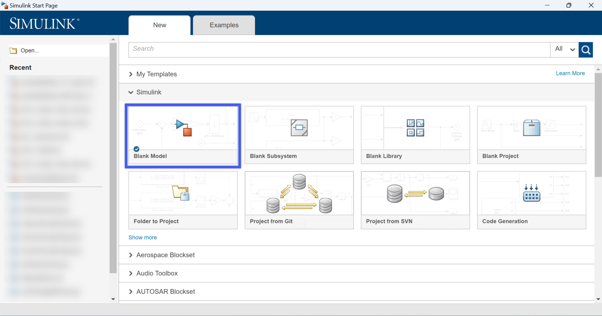

Add a "Predict" block using search in **Library Browser**, or by double\-clicking on the Simulink canvas to type "Predict" in quick insert.

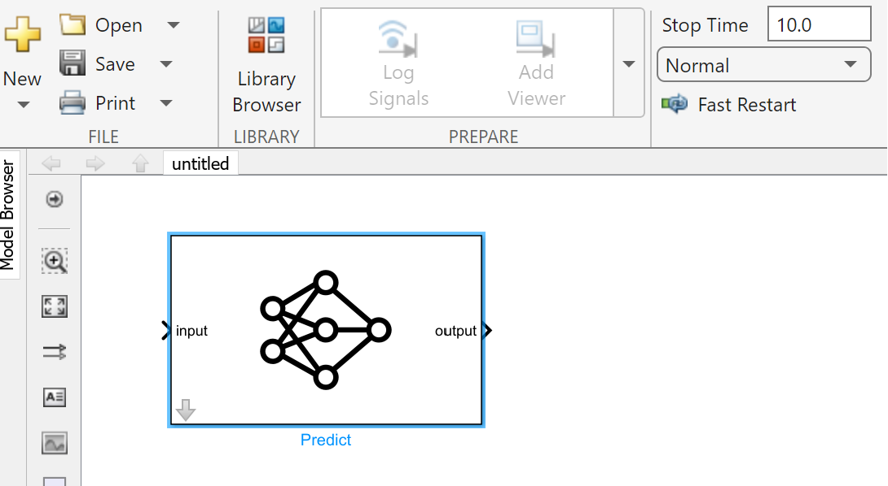

<a id="TMP_9de9"></a>

## Configure Network to Use for Predict Block

Double click on the **Predict Block** to open the **Block Parameters** menu. Specify the path to the myTrainedNet.mat in the current directory as the File path. Specify the **Input data format** as "CB" \- this means the input data is formatted as *c*\-by\-*n* array, where *c* is the number of features, and *n* is the number of observations. Save the model.

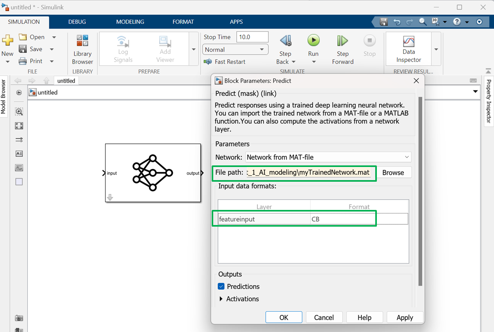

<a id="TMP_020e"></a>

## Configure Model Parameters for Simulations

Open the **Configuration Parameters** dialog (or Ctrl+E) and set **Stop time** to the workspace variable named "steps" (which is the total number of simulation steps; this variable will be generated in a later section), and set the solver to "Fixed\-step" and "Discrete" with a fundamental step size of 1:

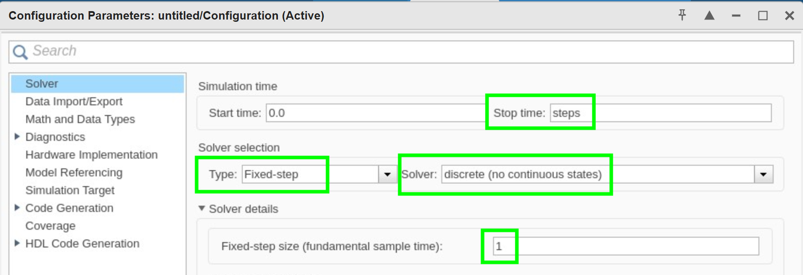

Also, set the **Simulation Target** language to C++:

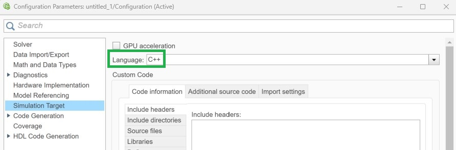

<a id="TMP_41c9"></a>

## **Connect the Model**

Save the model as myE`xampleModel.slx`. Then add two "From Workspace" blocks with "X\_in" and "true\_SOC" for the data variables, respectively. Connect the "X\_in" input to the "Predict" block. Connect the outputs with a "Scope" block in the following way:

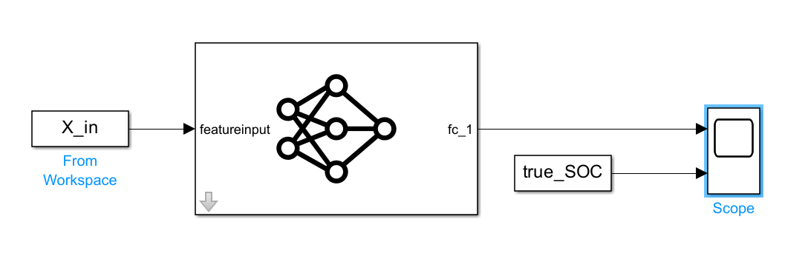

<a id="TMP_25c3"></a>

## Run the Simulink Model

Now we can simulate the model by clicking the "Run" button and double\-click on the "Scope" block to inspect simulation results:

(You may check `exampleModel_MATLAB_model.slx` if you run into any issues)

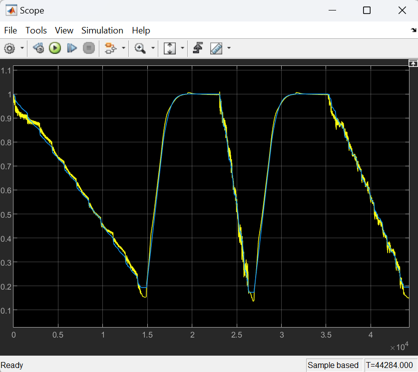

<a id="H_7BF2DEA5"></a>

# References

\[1\] Kollmeyer, Phillip, Carlos Vidal, Mina Naguib, and Michael Skells. “LG 18650HG2 Li\-Ion Battery Data and Example Deep Neural Network XEV SOC Estimator Script.” Mendeley, March 5, 2020. https://doi.org/10.17632/CP3473X7XV.3.

*Copyright 2025 The MathWorks, Inc.*